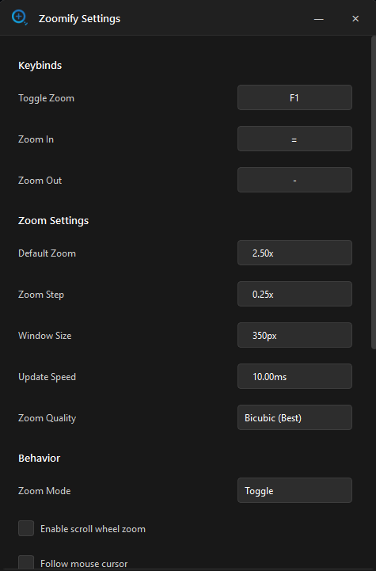

# Zoomify
A lightweight screen magnification tool for Windows, inspired by the [Zoomify](https://modrinth.com/mod/zoomify) Minecraft mod. I loved how clean and responsive Zoomify felt in-game and wanted something that works the same way across my entire desktop in any game, any app, anywhere.



## Features
- **Toggle Zoom** - Magnify the center of your screen with a single keypress.
- **Spyglass Mode** - Replaces the small zoom window with a large centered overlay covering up to 95% of your screen.
- **Smooth Zoom Transitions** - Lerp-based interpolation between zoom levels instead of hard snapping.
- **Follow Cursor** - Zoom follows your mouse position instead of locking to screen center.
- **Vignette Edge Fade** - Smooth circular fade-out on the spyglass overlay edges.
- **Scroll Wheel Zoom** - Adjust zoom level with the scroll wheel while zoomed in.
- **Custom Keybinds** - Set any key for toggle, zoom in, and zoom out using built-in key capture buttons.
- **Toggle or Hold Mode** - Choose between press-to-toggle or hold-to-zoom behavior.
- **High Performance** - Uses dxcam (Desktop Duplication API) and OpenCV for 240Hz+ capable capturing with minimal CPU usage.
- **Modern UI** - Clean frameless dark theme with rounded corners and a system tray icon.
- **Auto-Apply Settings** - Changes preview live, no restart required.

## Usage
1. Run `Zoomify.exe` or `python main.py`.
2. The app starts in the system tray. Right-click the tray icon or double-click it to open settings.
3. Press `F1` (default) to toggle zoom on/off.
4. Use `=` and `-` to adjust zoom level while zoomed in.
5. Enable spyglass mode in settings for a large centered overlay instead of the small window.

## Requirements
- Windows 10/11
- A dedicated GPU is recommended for best capture performance

## Building from Source
```
pip install dxcam opencv-python numpy pynput PyQt6
python main.py
```

## Notes
- The zoom overlay is automatically excluded from screen capture using `SetWindowDisplayAffinity`, so it will not appear in screenshots, screen recordings, or screenshares.
- Due to how the Windows Desktop Duplication API works, there is no way to make the overlay visible to capture software without causing an infinite zoom loop. This is a Windows-level limitation.
